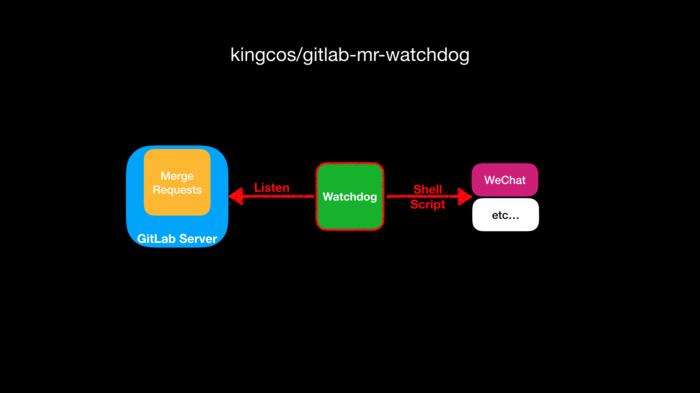

# gitlab-mr-watchdog

[](https://travis-ci.org/kingcos/gitlab-mr-jira-issue-trigger) [](https://goreportcard.com/report/github.com/kingcos/gitlab-mr-jira-issue-trigger) [](https://github.com/kingcos/gitlab-mr-jira-issue-trigger/blob/master/LICENSE)

English | [中文](README_CN.md)

Watch your GitLab merge requests status, then notify you in time.



> If your team is using WeChat for enterprise, you can try this [Go script](https://gist.github.com/kingcos/86e399f455495a8bbbdc30a4b6e1d482) as shell command to send text message.

## Configurations

```yml
GitLab:
  host: GITLAB_HOST_ADDRESS (REQUIRED)
  owner: GITLAB_PROJECT_OWNER (REQUIRED)
  project: GITLAB_PROJECT_NAME (REQUIRED)
  token: GITLAB_PUBLIC_USER_TOKEN (REQUIRED)

TimeOut:
  created: TIMEOUT_DURATION_SINCE_CREATED (MINUTES)
  updated: TIMEOUT_DURATION_SINCE_UPDATED (MINUTES)
  start: TIME_START_OF_A_DAY (hh:mm)
  end: TIME_END_OF_A_DAY (hh:mm)

Watchdog:
  duration: WATCHDOG_REFRESH_DURATION (MINUTES)
  action:
    sh: WATCHDOG_SHELL_ACTION
```
